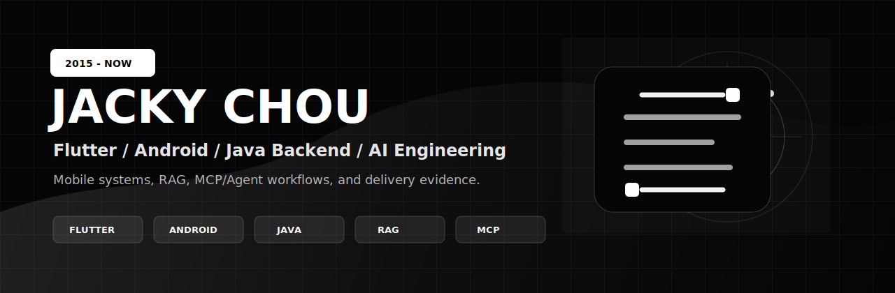

  

# Jacky Chou

**Flutter / Android / Java / AI Engineering** 
2015 年开始从事移动端与业务系统开发，长期交付真实业务 App、Android 原生能力、Spring Boot 后端、Vue 管理后台、RAG 知识库和 AI 工作流。

I build mobile business systems, Java backends, admin platforms, and practical AI workflows with verifiable delivery evidence.

  
  
  
  

## Fast Review

| For | Start Here | What You Can Verify |
| --- | --- | --- |
| Interview | [Online resume](https://mikehot.cloud/resume/) | Work history, stack depth, case summaries, delivery scope |
| Client | [Portfolio](https://mikehot.cloud) | App, backend, admin, AI workflow and project packaging |
| Code review | [Public RAG demo](https://github.com/mikehot/springboot-ai-rag-demo) | Spring Boot API, tests, CI, retrieval boundary, source citation |
| Private review | Email request | Private repositories, commit history, screenshots, build logs, deployment notes |

## Core Stack

| Area | Production Focus | Technologies |
| --- | --- | --- |
| Mobile apps | Business flows, state management, permissions, media upload, camera, QR scan, location, push, sharing, release checks | Flutter, Dart, Android Java/Kotlin, MethodChannel, Gradle |
| Java backend | API design, auth, RBAC, audit trails, async jobs, business state machines, smoke validation | Spring Boot, PostgreSQL, Redis, Docker, JWT/RBAC |
| Admin systems | Operations dashboard, list/detail workflow, tickets, approvals, role boundaries, audit view | Vue 3, TypeScript, Element Plus |
| AI engineering | RAG Q&A, citations, out-of-scope handling, local/cloud model provider boundary, human handoff, tool workflows | Embedding, pgvector, OpenAI-compatible APIs, MCP, Agent workflow |
| Delivery | CI, static build, deployment, domain, HTTPS, verification notes, rollback-friendly release habits | GitHub Actions, Nginx, Alibaba Cloud, Linux |

## Selected Work

| Case | Positioning | Link |
| --- | --- | --- |
| Pocket Home Flutter | Multi-platform Flutter business App with Android native capability integration and real-device proof | [Case study](https://mikehot.cloud/projects/pocket-home-flutter/) |
| AI Customer Service Ticket System | AI answer first, low-confidence human handoff, ticket workflow closure | [Case study](https://mikehot.cloud/projects/ai-customer-service/) |
| AI Weekly Business Report | CSV/Excel upload, async calculation, reviewable AI-generated business report | [Case study](https://mikehot.cloud/projects/ai-weekly-report/) |
| RAG Knowledge Base | Upload, chunking, embedding, Top-K retrieval, source citation, out-of-scope boundary | [Case study](https://mikehot.cloud/projects/rag-knowledge-base/) |
| Field Service Ops Platform | Spring Boot + Vue admin base for RBAC, customer, ticket, approval and audit workflows | [Case study](https://mikehot.cloud/projects/field-service-ops/) |

## Public Demo

| Repository | What It Demonstrates | CI |
| --- | --- | --- |
| [mikehot/springboot-ai-rag-demo](https://github.com/mikehot/springboot-ai-rag-demo) | Sanitized Spring Boot RAG Q&A API with sample documents, retrieval, citations, `found=false` boundary, tests and CI |  |

## Delivery Principles

- **Evidence first**: screenshots, build logs, lint/build checks, CI status, smoke scripts and deployment notes are part of the deliverable.
- **AI with boundaries**: AI output should be source-backed, reviewable, and able to hand off when confidence or context is insufficient.
- **System delivery**: App, backend, admin, data model, model provider, deployment and validation are treated as one product path.
- **Scoped MVP**: for client work, the first release is controlled by scope, milestones and acceptance criteria before adding advanced features.

## Current Focus

- Flutter business App delivery and Android native capability integration.
- Spring Boot + Vue admin systems for small and medium business workflows.
- RAG knowledge bases, AI customer service, report generation, MCP/Agent workflows and local LLM validation.
- Portfolio-grade proof materials for hiring, freelance and client review.

## Contact

- Website: [mikehot.cloud](https://mikehot.cloud)
- Resume: [mikehot.cloud/resume](https://mikehot.cloud/resume/)
- Email: [mikehot668@gmail.com](mailto:mikehot668@gmail.com)
